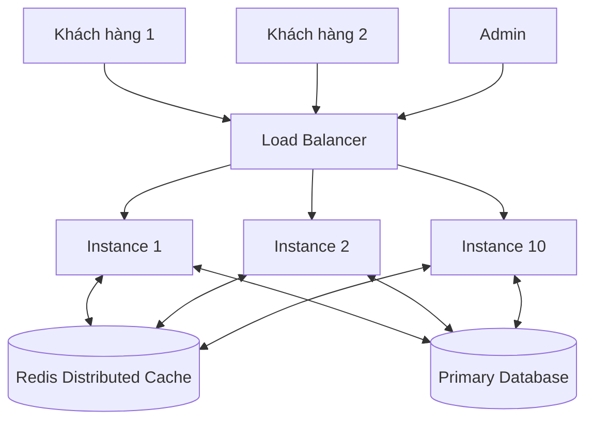

# BÁO CÁO PHÂN TÍCH LỖI: VÁ LỖI "BÁN GIÁ KHÔNG ĐỒNG NHẤT" - LOCAL CACHE VS DISTRIBUTED CACHE

**Họ và tên:** Rika & Team  
**Khóa học:** Microservices Architecture & Java Spring Boot  
**Bài tập:** Bài tập 1 - Session 16  
**Repository:** [https://github.com/Microservice-Java/Microservice-SS16.git](https://github.com/Microservice-Java/Microservice-SS16.git)

---

## 1. Phân tích Nguyên nhân Kỹ thuật gây lỗi "Bán giá không đồng nhất"

### 1.1. Bối cảnh Hệ thống
Hệ thống Flash Sale chạy trên **10 instances** độc lập đằng sau Load Balancer để phục vụ 2 triệu người dùng đồng thời. Mỗi instance chạy trên một JVM riêng lẻ, có không gian bộ nhớ Heap hoàn toàn tách biệt.

### 1.2. Đoạn mã nguồn bị lỗi (Legacy Code)
```java
@Service
public class ProductPriceService {
    // Local Cache - Mỗi instance giữ 1 bản sao HashMap riêng trong RAM của JVM
    private final Map<String, Integer> localPriceCache = new HashMap<>();

    public Integer getProductPrice(String productId) {
        if (localPriceCache.containsKey(productId)) {
            return localPriceCache.get(productId);
        }
        Integer price = productRepository.findPriceById(productId);
        localPriceCache.put(productId, price);
        return price;
    }

    public void updateProductPrice(String productId, Integer newPrice) {
        productRepository.updatePrice(productId, newPrice);
        localPriceCache.put(productId, newPrice); // Chỉ cập nhật HashMap của INSTANCE HIỆN TẠI!
    }
}
```

### 1.3. Nguyên nhân gây lệch dữ liệu (Cache Drift)
1. **Không gian bộ nhớ bị cô lập (Isolated Heap Space):** `HashMap` nằm trong bộ nhớ RAM local của JVM từng instance. Instance 1 không thể truy cập hay biết được bộ nhớ của Instance 2..10.
2. **Thiếu cơ chế vô hiệu hóa bộ nhớ đệm xuyên instance (Missing Cache Invalidation Mechanism):** Khi một Admin thực hiện cập nhật giá qua `updateProductPrice()`, request được Load Balancer điều phối ngẫu nhiên tới **Instance 1**. Instance 1 cập nhật Database và cập nhật `localPriceCache` **của riêng nó**.
3. **Hiện tượng Stale Data:** 9 instance còn lại (Instance 2 $\rightarrow$ Instance 10) **hoàn toàn không hay biết** giá trong DB đã thay đổi. Kết quả là khi khách hàng gửi request trúng các instance này, họ vẫn nhận được giá cũ đã lưu trong `localPriceCache` cho đến khi service khởi động lại.

---

## 2. Test Case Minh họa Luồng lỗi (Timeline T0 - T3)

Giả sử sản phẩm **P001** ban đầu có giá **100.000đ**, sau đó giảm còn **80.000đ** trong đợt Flash Sale.

| Mốc thời gian | Hành động | Trạng thái DB | Instance 1 (`localPriceCache`) | Instance 2 (`localPriceCache`) | Kết quả người dùng thấy |
|---|---|---|---|---|---|
| **T0** (Ban đầu) | Khởi tạo sản phẩm | `P001: 100.000` | `{}` *(Trống)* | `{}` *(Trống)* | Chưa có request. |
| **T1** | Khách 1 truy cập qua Inst1, Khách 2 truy cập qua Inst2 | `P001: 100.000` | `{"P001": 100000}` | `{"P001": 100000}` | Cả Khách 1 & Khách 2 đều thấy **100.000đ**. |
| **T2** | Admin cập nhật giá Flash Sale **80.000đ** (Request trúng **Inst1**) | `P001: 80.000` | `{"P001": 80000}` *(Updated)* | `{"P001": 100000}` *(Stale!)* | DB & Inst1 đã đổi giá, nhưng Inst2 vẫn giữ giá cũ 100.000đ. |
| **T3** | Khách 3 truy cập trúng **Inst1**, Khách 4 truy cập trúng **Inst2** | `P001: 80.000` | `{"P001": 80000}` | `{"P001": 100000}` | **LỖI:** Khách 3 thấy giá **80.000đ**, Khách 4 thấy giá **100.000đ**! |

> **Hậu quả:** Gây bất bình đẳng giá giữa các người dùng trong cùng một thời điểm, làm hư hại uy tín của sàn TMĐT và vi phạm tính nhất quán dữ liệu.

---

## 3. Giải pháp Kỹ thuật: Distributed Cache với Redis

### 3.1. Kiến trúc Tổng thể
Thay thế `HashMap` cục bộ bằng **Redis Distributed Cache** tập trung. Mọi instance (1 $\rightarrow$ 10) đều truy vấn và xoá cache trên cùng một Redis cluster.



### 3.2. Mã nguồn đã tái cấu trúc (`ProductPriceService.java`)
Sử dụng Spring Cache Annotations (`@Cacheable`, `@CacheEvict`) kết hợp kiểm soát tham số đầu vào:

```java
@Service
@RequiredArgsConstructor
@Slf4j
public class ProductPriceService {

    public static final String CACHE_NAME = "product_prices";
    private final ProductRepository productRepository;

    @Cacheable(
        value = CACHE_NAME, 
        key = "#productId", 
        condition = "#productId != null && !#productId.trim().isEmpty()", 
        unless = "#result == null"
    )
    public Integer getProductPrice(String productId) {
        validateProductId(productId);
        log.info("[DB Query] Fetching price from database for productId: {}", productId);

        return productRepository.findById(productId)
                .map(Product::getPrice)
                .orElseThrow(() -> new IllegalArgumentException("Product not found with ID: " + productId));
    }

    @Transactional
    @CacheEvict(
        value = CACHE_NAME, 
        key = "#productId", 
        condition = "#productId != null && !#productId.trim().isEmpty()"
    )
    public void updateProductPrice(String productId, Integer newPrice) {
        validateProductId(productId);
        if (newPrice == null || newPrice < 0) {
            throw new IllegalArgumentException("New price must be non-negative");
        }

        log.info("[DB Update & Cache Evict] Updating price in database to {} for productId: {}", newPrice, productId);

        Product product = productRepository.findById(productId)
                .orElseGet(() -> Product.builder().id(productId).name("Product " + productId).build());

        product.setPrice(newPrice);
        productRepository.save(product);
    }

    private void validateProductId(String productId) {
        if (productId == null || productId.trim().isEmpty()) {
            throw new IllegalArgumentException("Product ID must not be null or blank");
        }
    }
}
```

---

## 4. Xử lý các Tình huống Ngoại lệ & Khả năng Chịu lỗi (Fault Tolerance)

### 4.1. Tình huống Redis Server Down / Connection Timeout
**Vấn đề:** Nếu Redis server bị ngắt kết nối hoặc gặp sự cố mạng, các Annotation `@Cacheable` và `@CacheEvict` mặc định sẽ quăng ngoại lệ (`RedisConnectionFailureException`) khiến API bị sập hoàn toàn.

**Giải pháp:** Tích hợp `CustomCacheErrorHandler` implements `CacheErrorHandler`:
```java
@Slf4j
public class CustomCacheErrorHandler implements CacheErrorHandler {

    @Override
    public void handleCacheGetError(RuntimeException exception, Cache cache, Object key) {
        log.warn("[Cache Error Fallback] Unable to retrieve key '{}' from cache. Falling back to database. Cause: {}", key, exception.getMessage());
    }

    @Override
    public void handleCachePutError(RuntimeException exception, Cache cache, Object key, Object value) {
        log.warn("[Cache Error Fallback] Unable to put key '{}' into cache. Operations continue with DB. Cause: {}", key, exception.getMessage());
    }

    @Override
    public void handleCacheEvictError(RuntimeException exception, Cache cache, Object key) {
        log.warn("[Cache Error Fallback] Unable to evict key '{}' from cache. Operations continue with DB. Cause: {}", key, exception.getMessage());
    }

    @Override
    public void handleCacheClearError(RuntimeException exception, Cache cache) {
        log.warn("[Cache Error Fallback] Unable to clear cache. Operations continue with DB. Cause: {}", exception.getMessage());
    }
}
```
*Đăng ký `CustomCacheErrorHandler` trong `RedisConfig` ngắt hoàn toàn việc bắn lỗi ra client, giúp ứng dụng tự động chuyển sang đọc/ghi trực tiếp từ Database khi Redis gặp sự cố.*

### 4.2. Tình huống Tham số `productId` null hoặc rỗng
- **Cơ chế Fail-Fast:** Đẩy mạnh kiểm tra điều kiện ở đầu hàm (`validateProductId()`) để quăng `IllegalArgumentException` ngay lập tức.
- **Tránh rác Cache:** Thêm thuộc tính `condition = "#productId != null && !#productId.trim().isEmpty()"` vào `@Cacheable` và `@CacheEvict` để chặn tạo các key rác (ví dụ `product_prices::` hoặc `product_prices::null`) trên Redis.

---

## 5. Hướng dẫn Cài đặt & Chạy Kiểm thử

### Yêu cầu môi trường
- Java 17+
- Gradle 8.x

### Lệnh chạy Unit & Integration Test
```bash
cd SS16/BaiTap1
./gradlew test
```

### Kết quả chạy kiểm thử
- **1. Test mô phỏng mất nhất quán của Local Cache HashMap (Multi-Instance)**: PASSED (`testLocalCacheInconsistency_MultiInstanceProblem`).
- **2. Test đọc giá & Cache hit/miss**: PASSED (`testGetProductPrice_Success`).
- **3. Test cập nhật giá & Cache Eviction**: PASSED (`testUpdateProductPrice_Success`).
- **4. Test Fail-Fast khi tham số null/rỗng**: PASSED (`testInputValidation_NullOrBlankProductId`).
- **5. Test Fallback khi Redis down**: PASSED (`testCustomCacheErrorHandler_FallbackOnRedisDown`).

---

## 6. Kết luận
Giải pháp chuyển đổi sang **Redis Distributed Cache** đính kèm `CustomCacheErrorHandler` đã khắc phục triệt để sự cố "Bán giá không đồng nhất", đảm bảo tính nhất quán dữ liệu giữa 10 instances trong giờ cao điểm Flash Sale mà vẫn duy trì tính sẵn sàng cao (High Availability) khi Redis gặp sự cố.
