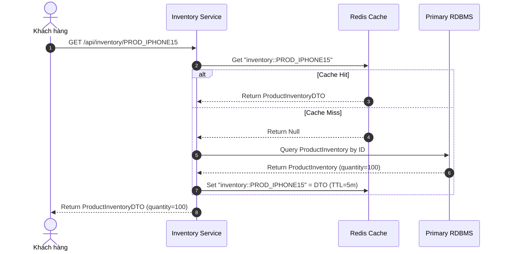
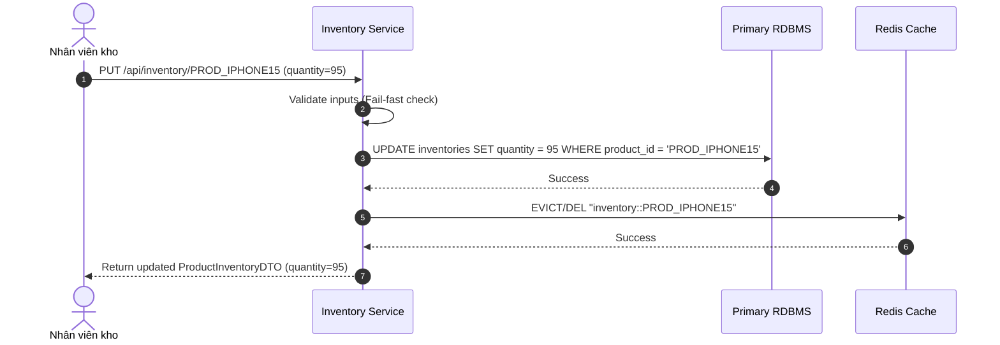

# BÁO CÁO PHÂN TÍCH: HỆ THỐNG QUẢN LÝ TỒN KHO CHÍNH XÁC – CACHE-ASIDE PATTERN

**Họ và tên:** Rika & Team  
**Khóa học:** Microservices Architecture & Java Spring Boot  
**Bài tập:** Bài tập 3 - Session 16  
**Repository:** [https://github.com/Microservice-Java/Microservice-SS16.git](https://github.com/Microservice-Java/Microservice-SS16.git)

---

## 1. Phân tích Thiết kế Cache-Aside Pattern trong Hệ thống Tồn kho Tiki

### 1.1. Khái niệm & Nguyên lý Cache-Aside
Cache-Aside (hay còn gọi là Lazy Loading Caching) là mô hình thiết kế bộ nhớ đệm trong đó ứng dụng trực tiếp chịu trách nhiệm tương tác với cả Bộ nhớ đệm (Redis) và Cơ sở dữ liệu chính (RDBMS).

### 1.2. Luồng Xử lý Đọc (Read Operation)
1. Khi khách hàng xem sản phẩm `PROD_IPHONE15`, ứng dụng gửi truy vấn tới **Redis Cache** trước.
2. **Trường hợp Cache Hit:** Redis trả về ngay `ProductInventoryDTO` (thời gian phản hồi < 10ms).
3. **Trường hợp Cache Miss:** 
   - Ứng dụng truy xuất **RDBMS Database** để lấy số lượng tồn kho thực tế.
   - Nạp kết quả tìm được từ DB vào Redis Cache.
   - Trả về `ProductInventoryDTO` cho khách hàng.



### 1.3. Luồng Xử lý Ghi (Write Operation)
1. Khi nhân viên kho cập nhật số lượng tồn kho (ví dụ: cập nhật từ 100 xuống 95):
2. Ứng dụng thực hiện **Cập nhật vào Database (RDBMS) trước**.
3. Sau khi DB cập nhật thành công, ứng dụng thực hiện **Hủy bỏ (Evict/Delete) Key cũ** trong Redis Cache.
4. Lần đọc tiếp theo của người dùng sẽ gặp Cache Miss, tự động lấy dữ liệu mới nhất (95) từ DB và nạp lại vào Redis.



---

## 2. Giải quyết các Bẫy Dữ liệu & Tình huống Biên (Edge Cases)

### 2.1. Tình huống 1: Nhập Số lượng Tồn kho Âm (`newQuantity < 0`)
- **Rủi ro:** Nhập số lượng âm (ví dụ `-10`) dẫn đến sai lệch số lượng bán, gây nguy cơ bán hàng vượt tồn kho thực tế.
- **Giải pháp:** 
  - Kiểm tra Fail-fast ngay ở đầu hàm `updateInventory`:
  ```java
  if (newQuantity == null || newQuantity < 0) {
      throw new IllegalArgumentException("Inventory quantity cannot be negative");
  }
  ```
  - Nếu `newQuantity < 0`, ứng dụng lập tức ngắt luồng, ném `IllegalArgumentException` và không thực thi ghi DB hay Evict cache.

### 2.2. Tình huống 2: Sự cố Kết nối Redis khi Đọc (Cache Read Error)
- **Giải pháp:** Đăng ký `CustomCacheErrorHandler` implements `CacheErrorHandler`:
  ```java
  @Override
  public void handleCacheGetError(RuntimeException exception, Cache cache, Object key) {
      log.warn("[Cache-Aside Fallback] Redis Read Failure for key '{}'. Falling back to Database read.", key);
  }
  ```
  *Bắt ngoại lệ kết nối/timeout Redis và swallow lỗi, cho phép luồng đọc tự động fallback truy vấn RDBMS mà ứng dụng không bị dừng.*

### 2.3. Tình huống 3: Sự cố Kết nối Redis khi Xóa (Cache Evict Error)
- **Vấn đề:** Khi nhân viên kho vừa cập nhật DB lên 95, nhưng lệnh xóa cache Redis bị sập do ngắt kết nối mạng. Key cũ (100) vẫn còn nằm trong Redis. Khi Redis kết nối lại, người dùng có thể đọc phải giá trị đệm cũ (100).
- **Giải pháp Đa tầng (Multi-layered Mitigation):**
  1. **Short TTL (TTL Ngắn):** Đặt TTL ngắn cho tất cả cache key tồn kho (ví dụ: 5 phút). Nếu lệnh `@CacheEvict` bị thất bại, dữ liệu cũ trong Redis sẽ tự động bị tiêu hủy sau tối đa 5 phút.
  2. **Active Eviction Retry / Log Alerting:** Ghi log warning mức độ cao để kích hoạt hệ thống giám sát (Monitoring/Alert) phát hiện vết đệm bị dính (Stale Key Alert).

---

## 3. Mã nguồn Triển khai (`InventoryService.java`)

```java
@Service
@RequiredArgsConstructor
@Slf4j
public class InventoryService {

    private final InventoryRepository inventoryRepository;

    @Cacheable(
        value = RedisConfig.INVENTORY_CACHE,
        key = "#productId",
        condition = "#productId != null && !#productId.trim().isEmpty()",
        unless = "#result == null"
    )
    public ProductInventoryDTO getInventory(String productId) {
        validateProductId(productId);
        log.info("[Cache-Aside Read: DB Query] Fetching inventory from Database for productId: {}", productId);

        return inventoryRepository.findById(productId)
                .map(this::convertToDTO)
                .orElse(null);
    }

    @Transactional
    @CacheEvict(
        value = RedisConfig.INVENTORY_CACHE,
        key = "#productId",
        condition = "#productId != null && !#productId.trim().isEmpty()"
    )
    public ProductInventoryDTO updateInventory(String productId, Integer newQuantity) {
        validateProductId(productId);
        if (newQuantity == null || newQuantity < 0) {
            throw new IllegalArgumentException("Inventory quantity cannot be negative");
        }

        log.info("[Cache-Aside Write: DB Update & Evict] Updating DB quantity to {} for productId: {}", newQuantity, productId);

        ProductInventory inventory = inventoryRepository.findById(productId)
                .orElseGet(() -> ProductInventory.builder().productId(productId).productName("Product " + productId).build());

        inventory.setQuantity(newQuantity);
        ProductInventory saved = inventoryRepository.save(inventory);

        return convertToDTO(saved);
    }
}
```

---

## 4. Kết quả Chạy Kiểm thử (`InventoryServiceTest.java`)

### Lệnh chạy kiểm thử:
```bash
cd SS16/BaiTap3
./gradlew test
```

### Các Kịch bản đã Kiểm thử:
1. `testCacheAsideReadWrite_FlowSuccess`:
   - Lần 1 Read (Cache Miss): Gọi DB nạp đệm.
   - Lần 2 Read (Cache Hit): Đọc trực tiếp từ Cache, số lần gọi DB giữ nguyên = 1.
   - Write Update (95): Cập nhật DB & xóa Cache đệm.
   - Lần 3 Read: Gặp Cache Miss, đọc DB lấy 95 thành công.
2. `testNegativeQuantityValidation_ThrowsException`: Thao tác update với `-10` ném `IllegalArgumentException("Inventory quantity cannot be negative")` và không ghi DB.
3. `testInputValidation_NullOrBlankProductId`: Fail-fast với `productId` null/rỗng.
4. `testCustomCacheErrorHandler_FallbackOnRedisDown`: Xác minh `CustomCacheErrorHandler` fallback đọc DB mượt mà khi Redis bị gián đoạn.

---

## 5. Kết luận
Hệ thống Quản lý Tồn kho Tiki áp dụng thành công **Cache-Aside Pattern** chuẩn hóa với Spring Boot & Redis Distributed Cache, giúp đảm bảo tốc độ phản hồi cao cho thao tác đọc, duy trì tính nhất quán khi ghi và chống chịu lỗi cao khi Redis gặp sự cố.
