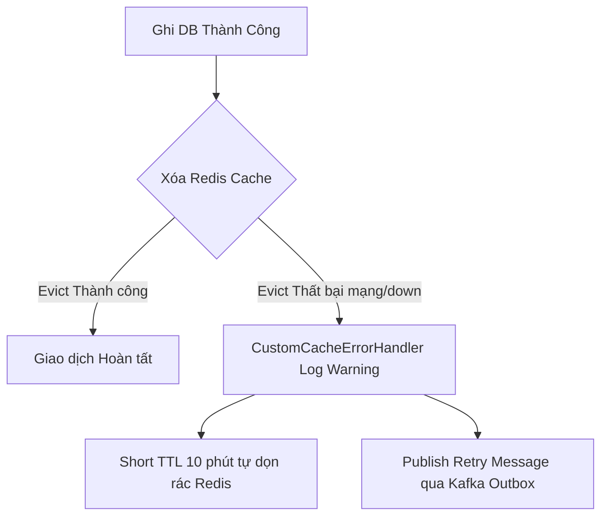

# BÁO CÁO PHÂN TÍCH: CHIẾN LƯỢC CẬP NHẬT CACHE – XÓA HAY GHI ĐÈ? (@CACHEEVICT VS @CACHEPUT)

**Họ và tên:** Rika & Team  
**Khóa học:** Microservices Architecture & Java Spring Boot  
**Bài tập:** Bài tập 4 - Session 16  
**Repository:** [https://github.com/Microservice-Java/Microservice-SS16.git](https://github.com/Microservice-Java/Microservice-SS16.git)

---

## 1. Phân tích Yêu cầu Input / Output

Thao tác cập nhật sản phẩm trên hệ thống TMĐT yêu cầu các tham số đầu vào và đầu ra rõ ràng:
- **Đầu vào (Input):** 
  - `productId` (`String`): Mã sản phẩm (Bắt buộc, không null hay rỗng).
  - `UpdateProductRequestDTO`: Chứa các thông tin cần cập nhật (`name`, `price`, `stockQuantity`, `description`). `price` và `stockQuantity` phải $\ge 0$.
- **Đầu ra (Output):**
  - `ProductDTO`: Chứa đầy đủ thông tin chi tiết của sản phẩm sau khi đã ghi thành công vào Database.

---

## 2. Trình bày và So sánh hai Chiến lược Cập nhật Cache

Spring Cache cung cấp 2 annotation đại diện cho 2 chiến lược đồng bộ dữ liệu đệm khi có thao tác ghi/cập nhật:
- **`@CachePut` (Write-Through / Overwrite Cache):** Thực thi phương thức cập nhật, ghi dữ liệu mới vào DB, sau đó **lập tức ghi đè (update)** giá trị vừa trả về vào Redis Cache dưới key tương ứng.
- **`@CacheEvict` (Cache Invalidation / Delete Cache):** Thực thi phương thức cập nhật, ghi dữ liệu mới vào DB, sau đó **hủy bỏ (xóa/delete)** key tương ứng khỏi Redis Cache. Lần đọc tiếp theo sẽ lười nạp (Lazy Load) dữ liệu mới từ DB.

### Bảng So sánh Chi tiết 4 Tiêu chí Kỹ thuật

| Tiêu chí | `@CachePut` (Ghi đè đệm) | `@CacheEvict` (Xóa đệm - Lựa chọn) |
|---|---|---|
| **1. Nguy cơ Race Condition (Ghi song song)** | **Rất cao (High Risk).** Khi 2 Admin cập nhật cùng sản phẩm A song song (Ghi 1 giá 100đ, Ghi 2 giá 80đ). Nếu DB xong theo thứ tự 1 $\rightarrow$ 2 nhưng Redis bị delay và ghi theo thứ tự 2 $\rightarrow$ 1, DB sẽ lưu 80đ nhưng Redis lại lưu 100đ $\rightarrow$ Lệch dữ liệu lâu dài! | **Rất thấp (Safe).** Cả 2 luồng ghi đều gửi lệnh `DEL` xóa key khỏi Redis. Lần đọc kế tiếp sẽ luôn lấy dữ liệu chuẩn mới nhất từ DB (80đ). |
| **2. Độ phức tạp trong Code** | Phải đảm bảo phương thức cập nhật luôn trả về đúng object DTO có định dạng khớp 100% với dữ liệu hàm `@Cacheable` lưu giữ. | Đơn giản, phương thức có thể trả về DTO, void hoặc boolean. Không cần quan tâm tới format dữ liệu đệm. |
| **3. Mức độ đảm bảo nhất quán** | Dễ vướng dữ liệu cũ (Stale Cache) nếu xảy ra race condition hoặc partial failure giữa DB và Redis. | Đảm bảo tính nhất quán tuyệt đối (Strong Eventual Consistency) cho lượt đọc kế tiếp. |
| **4. Ảnh hưởng tới Hiệu năng** | Không tốn thời gian Cache Miss cho lượt đọc đầu tiên sau ghi. Nhưng gây lãng phí bộ nhớ RAM Redis nếu sản phẩm đó không bao giờ được đọc nữa. | Chịu phạt Cache Miss (đọc DB + nạp Redis) đúng **01 lần duy nhất** cho lượt đọc đầu tiên sau ghi. Tiết kiệm RAM bộ nhớ đệm. |

---

## 3. Lựa chọn Chiến lược và Giải thích

### 3.1. Quyết định Kiến trúc cho Tỷ lệ Đọc/Ghi 100:1
Với vai trò Tech Lead, tôi quyết định lựa chọn chiến lược **`@CacheEvict` (Xóa Cache)** cho hệ thống TMĐT dựa trên các lập luận sau:

1. **Tỷ lệ 100:1 cực kỳ ưu ái cho `@CacheEvict`:** Cứ 100 lượt đọc mới có 1 lượt cập nhật. Việc chịu phạt độ trễ (Cache Miss) đúng 1 lần sau mỗi 100 lượt đọc là **hoàn toàn vô hại** so với lợi ích bảo vệ tính đúng đắn dữ liệu cho 99 lượt đọc còn lại.
2. **Triệt hạ triệt để nguy cơ Race Condition:** Trong các sàn TMĐT lớn, nhiều nhân viên kho hoặc công cụ tự động có thể cập nhật giá/tồn kho cùng lúc. `@CacheEvict` đảm bảo Redis không bao giờ bị lưu đè giá trị cũ do lệch thứ tự mạng.
3. **Chống lãng phí RAM Redis:** `@CachePut` tự động nạp mọi sản phẩm vừa update vào Redis kể cả các sản phẩm hết hàng hoặc ngừng kinh doanh không ai xem. `@CacheEvict` giúp Redis chỉ lưu trữ các sản phẩm thực sự có nhu cầu đọc (Hot Data).

### 3.2. Thiết kế Luồng Chịu lỗi khi Evict Thất bại (Redis Connection Down / Timeout)
Khi lệnh xóa đệm `@CacheEvict` bị hỏng do sự cố mạng với Redis, hệ thống áp dụng chiến lược chịu lỗi 3 lớp:



1. **Short TTL (TTL Ngắn 10 phút):** Mọi key đệm sản phẩm đều gắn TTL 10 phút. Nếu xóa evict thất bại, dữ liệu đệm cũ trong Redis sẽ tự động bị tiêu hủy sau tối đa 10 phút.
2. **`CustomCacheErrorHandler` Graceful Fallback:** Bắt ngoại lệ Redis kết nối ngắt ngầm để luồng cập nhật DB của người dùng vẫn trả về kết quả thành công mà không bị sập.
3. **Transactional Outbox / Message Queue Retry:** Gửi sự kiện `ProductUpdatedEvent` sang Kafka/RabbitMQ để một Consumer độc lập thử lại lệnh xóa Redis (Retry Evict Pattern).

---

## 4. Hướng dẫn Cài đặt & Kết quả Chạy Kiểm thử

### Lệnh chạy test
```bash
cd SS16/BaiTap4
./gradlew test
```

### Kết quả Kiểm thử (`ProductServiceTest.java`)
- **Build Status**: `BUILD SUCCESSFUL` (100% Passed).
- **Test 1 (`testCacheEvictStrategy_ReadWriteReadFlow`)**:
  - Lần 1 Read (Cache Miss): Đọc DB 45.000.000đ.
  - Lần 2 Read (Cache Hit): Đọc trực tiếp từ Redis Cache (không gọi DB).
  - Write Update: Cập nhật DB lên 42.000.000đ và thực thi `@CacheEvict`.
  - Lần 3 Read (Post-Evict Miss): Đọc DB lấy giá mới 42.000.000đ thành công.
- **Test 2 (`testInputValidation_NegativePriceOrStock`)**: Fail-fast khi giá hoặc tồn kho âm.
- **Test 3 (`testInputValidation_NullOrBlankProductId`)**: Fail-fast khi `productId` null/rỗng.
- **Test 4 (`testCustomCacheErrorHandler_FallbackOnRedisDown`)**: Xử lý fallback mượt mà khi Redis bị down.

---

## 5. Kết luận
Chiến lược **`@CacheEvict`** kết hợp với `@Cacheable` là sự lựa chọn hoàn hảo cho các hệ thống có tỷ lệ đọc/ghi lớn (100:1). Giải pháp giúp duy trì tính nhất quán tuyệt đối giữa Redis và Database, ngăn ngừa Race Condition khi ghi đồng thời, đồng thời đảm bảo tính sẵn sàng cao với `CustomCacheErrorHandler`.
